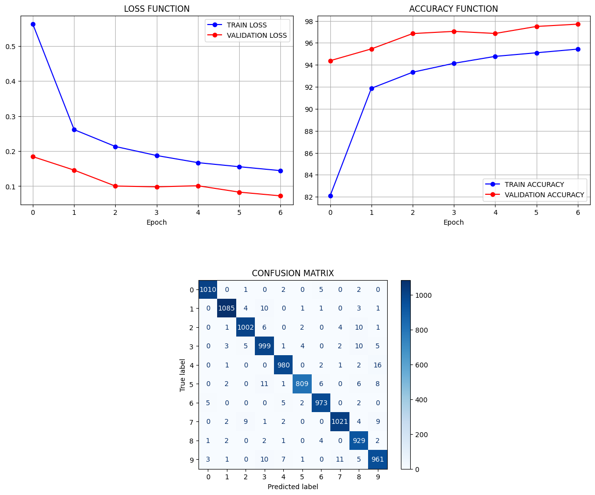

# MNIST Digit Classifier

A fully connected neural network built in PyTorch to classify handwritten digits from the MNIST dataset, featuring data augmentation, training/validation monitoring, and error analysis.

##  Overview
This project implements an end-to-end digit classification pipeline: loading and augmenting the MNIST dataset, training a multilayer perceptron (MLP), tracking training/validation metrics across epochs, and visualizing both aggregate performance and individual misclassified examples.

##  Features
* **Data Augmentation:** Random rotation (±10°) and random affine transforms (translation, scaling) on the training set to improve generalization.
* **Dataset Split:** 50,000 training images, 10,000 validation images, and the standard 10,000-image MNIST test set.
* **Custom MLP Architecture (`Neural_numbers`):** Input flattening → `Linear(784→128)` → `ReLU` → `Linear(128→128)` → `ReLU` → `Linear(128→10)`.
* **Training Pipeline:** Cross-Entropy loss, Adam optimizer, and progress bars via `tqdm`.
* **Device-Agnostic:** Automatically detects and utilizes CUDA, Apple MPS, or CPU.
* **Dashboard & Error Analysis:** Visualizations for loss/accuracy curves, confusion matrix, and misclassified test samples with ground-truth vs. predicted labels.
* **Parameter Counting:** Built-in utility to inspect total trainable parameters (~118k).

##  Tech Stack
* **Language:** Python
* **Framework:** PyTorch, torchvision
* **Libraries:** NumPy, Matplotlib, OpenCV, scikit-learn, tqdm

##  Results
* **Test Accuracy:** `98.18%`
* **Test Loss:** `0.056`
* Trained for 7 epochs with data augmentation (random rotation & affine transforms).



##  Quick Start

1. **Clone the repository:**
   ```bash
   git clone [https://github.com/ShuhaievaPolina/MNIST-Classification.git](https://github.com/ShuhaievaPolina/MNIST-Classification.git)
   cd MNIST-Classification
   ```

2. **Install dependencies:**
   ```bash
   pip install -r requirements.txt
   ```

3. **Run the notebook:**
   Open `MNIST.ipynb` in Google Colab or VS Code and run all cells.

##  Repository Structure
```text
.
├── assets/                  # Saved dashboard plots and misclassified samples
│   ├── loss_accuracy.png    # Loss & Accuracy plots + Confusion matrix
│   └── misclassified.png    # Sample of misclassified test images
├── MNIST.ipynb              # Main Google Colab / Jupyter notebook
├── mnist_mlp.pth            # Trained PyTorch model weights
├── requirements.txt         # Project dependencies
├── .gitignore               # Files ignored by Git
└── README.md                # Project documentation
```

##  Motivation
This project was built as a hands-on introduction to training neural networks in PyTorch — covering the full workflow from data loading and augmentation to model design, training, and error analysis on a classic benchmark dataset.
